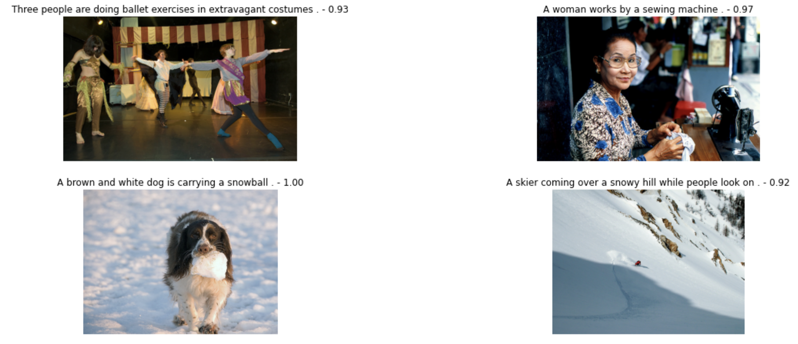
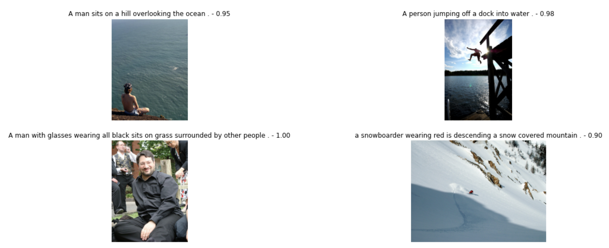

# Система поиска изображений по текстовому запросу

`Задача проекта` - создать модель, которая сможет по векторным представлениям изображений и текстов оценивать вероятность того, насколько текст и картинка подходят друг другу. В дальнейшем проверить насколько модель сможет подбирать релевантные изображения по текстовым описаниям

## Краткое описание входных данных

Для обучения моделей были предоставлены наборы различных фотографий и датасеты, хранящие: 
- названия изображений
- текстовые описания изображений 
- краудсорсинговые и экспертные оценки соответствия описания изображению самому изображению

## Общая задумка 
<ol>
  <li>Для каждой пары (изображение:текстовое описание) преобразовать оценки краудов и экспертов в вероятность соответствия описания картинке</li>
  <li>Преобразовать все текстовые описания в виде векторов (с помощью TF-IDF)</li>
  <li>Преобразовать все изображения в виде векторов (с помощью архитектуры сверточной нейронной сети ResNet50)</li>
  <li>Конкатенировать полученные вектора и на них обучить модели предсказывать вероятность соответствия картинки ее описанию (в качестве моделей были использованы модель линейной регрессии и полносвязная нейронная сеть)</li>
  <li>Написать функцию, которая будет принимать на вход любое текстовое описание, преобразовывать его в векторную форму, в цикле проходить по всем векторам изображений и выдавать ту картинку, оценка вероятности релевантности которой будет максимальной на основе предсказания модели</li>
</ol>

## Промежуточные итоги
- С помощью нейронной сети получилось добиться достаточно низкой ошибки на валидационной выборке
- К сожалению, при проверке модели по подбору наиболее релевантных фотографий по их текстовому описанию, модель выдавала одну и ту же картинку для любого описания. Это связано либо с малым объемом тренировочных данных, либо с тем, что TF-IDF не совсем подходит для решения поставленной задачи (матрица текстовых описаний получилась разреженной, что в свою очередь затрудняет модели процесс обучения)

## Пути решения возникшей проблемы
- Попробовать иначе составить текстовые эмбеддинги, к примеру word2vec, BERT (результаты это не улучшило, значит все же проблема в недостатке тренировочных данных)
- Использовать предобученную модель openai CLIP, которая как раз создана для поиска соответствия между запросом и фотографией

## Этапы использования модели CLIP
- Загрузить модель
- Преобразовать фотографии и текстовые описания в виде векторов одинаковой длины
- Посчитать косинусную близость между векторами описаний и векторами всех фотографий
- Для каждого описания выбрать фотографию с максимальной величиной косинусной близости

## Итог 
- С помощью предобученной модели CLIP получилось добиться превосходных результатов (все фотографии соответствуют их текстовому описанию)

## Демонстрация работы модели
Над каждой фотографией написан запрос по которому происходил отбор фото и рядом с ним оценка релевантности подобранной фотографии

